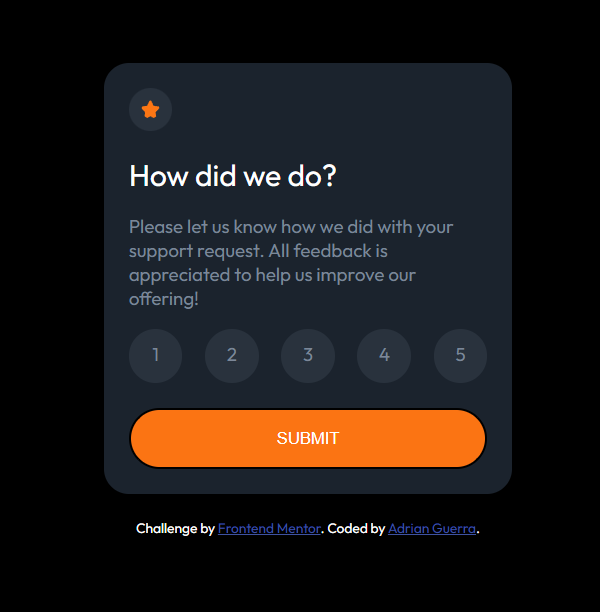
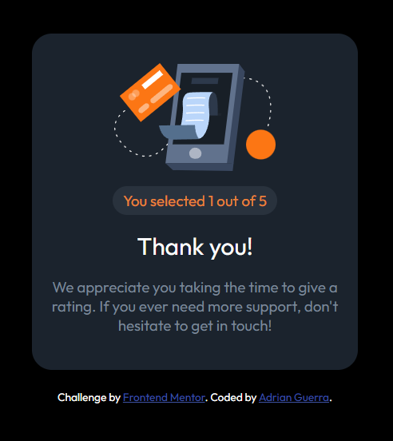

# Frontend Mentor - Interactive rating component solution

This is a solution to the [Interactive rating component challenge on Frontend Mentor](https://www.frontendmentor.io/challenges/interactive-rating-component-koxpeBUmI). Frontend Mentor challenges help you improve your coding skills by building realistic projects. 

## Table of contents

- [Overview](#overview)
  - [The challenge](#the-challenge)
  - [Screenshot](#screenshot)
  - [Links](#links)
- [My process](#my-process)
  - [Built with](#built-with)
  - [What I learned](#what-i-learned)
  - [Continued development](#continued-development)
  - [Useful resources](#useful-resources)
- [Author](#author)


## Overview

### The challenge

Users should be able to:

- View the optimal layout for the app depending on their device's screen size
- See hover states for all interactive elements on the page
- Select and submit a number rating
- See the "Thank you" card state after submitting a rating

### Screenshot




### Links

- Solution URL: (https://your-solution-url.com)
- Live Site URL: (https://interactive-rating-component-drab-theta.vercel.app/)

## My process

### Built with

- Semantic HTML5 markup
- CSS custom properties
- Flexbox
- JavaScript

### What I learned

I continued to familiarize myself with the DOM. 
Some code representing the final stretch of the project:

```js
function submit_rating() {
    // Checks if a rating is selected
    if (current_rating == ""){
        alert("Please select a rating!");
    }
    else {
        rate_card.style.display = "none";
        thank_you_card.style.display = "block";
        selection_msg.innerHTML = "You selected " + current_rating + " out of 5";
    }
}
```


### Continued development

I plan to get a better grasp of RWD fundamentals.

### Useful resources

- [web.dev](https://web.dev/responsive-web-design-basics/) - This helped simplify responsive web design for me.

## Author

- LinkedIn - [Adrian Guerra](https://www.linkedin.com/in/adrian-guerra-a210a4196/)
- Frontend Mentor - [@adie9](https://www.frontendmentor.io/profile/adie9)

